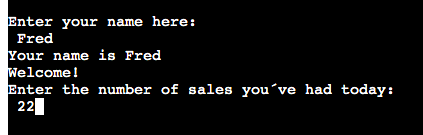
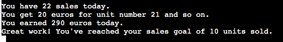
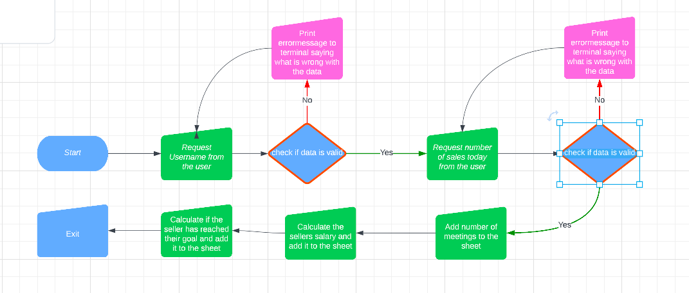
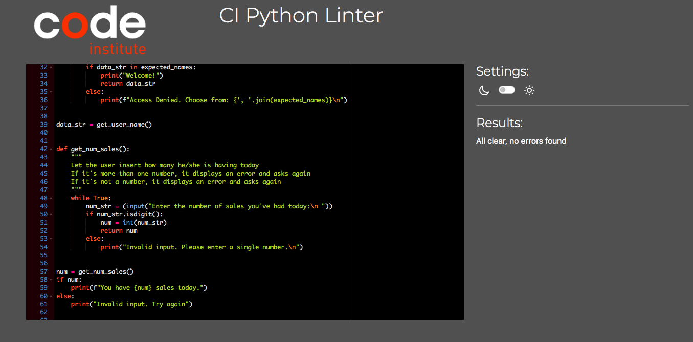

# Sales Team APP

The purpose of this app is to provide a fictiv salesteam to document their sales of the day and know how much they they earn for the day. 
The input the teammember gives will be added to a google sheet that documents and gives the member some calculated answers. 

- The team has a daily goal of 10 sold units per day.
- The seller receives their salary based on how much is sold per day

## Features 
1. The program gives the user a choice to input their name. If the name isn´t in the list of the team the answer will give an answer of invalid name and ask the question again.

2. The user gets a choice to input their number of sales today. If the answer isn´t a number, an errormessage prints out and the user gets that choice again. 

3. The app apends a new row to our google sheet with the members name and the number of sales. 

4. Now it is time for the user to know how much money they have earned so far for the day. The app takes the amount of sales and calculates what the user earned. It is common for a sales-team to have a salary escalator that depends on how much the seller have sold, so I included that in the app. 
It works like this. 
  - The seller gets 10 euro per sale for the first 10 sales. (1-10).
  - The seller gets 15 euro per sale for the next 10 sales. (11-20). 
  - The seller gets 20 euro per sale from sale number 21 and so on. 

The app prints out what seller has earned and appends that value to the googlesheet. 

5. The app calculates how much more sales the seller needs to have to reach the daily goal of 10 sales per day.

## Future features
- Calculate the average salesscore the team are having.
- A choice to restart or exit the program 

## Proccess 
- I started to figure out my idea and choose a sales-team app because I have experience from that type of work. 
- I came up with my features I would like to include and I started to create them. 
- I treated my program as a MVP and started to modify and develop my features. 
  - My salary feature did just multiply every number with 10 at the begining. I then developed it to multiply the first 10 with 10, second 10 with 15 and from number 21 with 20. 

### Lucidchart of the program

## Problems
My biggest problem in this project was to append rows into my google sheet. I was stuck for two days and I looked over and over on code institute walkthrough, looked at my creds.json file, and the google api with no luck. 
It was when I started to troubleshoot this problem methodically when I found out that the problem was in my function I had created. 
That gave me a relief and a good lesson for my future. 

## Testing
- I have tried to test my code for bugs using both my local terminal and the heroku terminal.
- I´ve tried to give letters when a number was expected, misspelled names, used lowercase letters and so on. 
- Passed the code through PEP8 linter and no errors are found.

## Remaing bugs
- No remaining bugs left.

## Validation 
- Passed the code through PEP8 linter and no errors were returned.

## Credits
- Code Institute for the education.
- My mentor for great feedback and support

