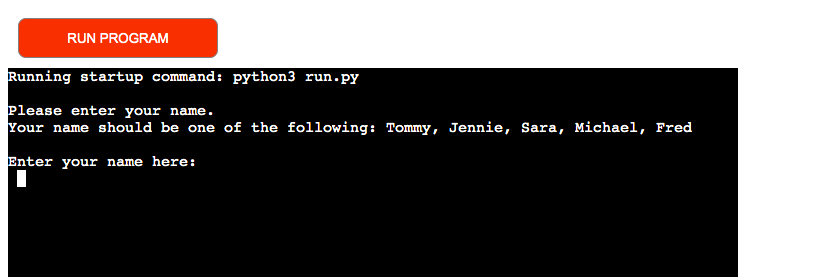

# Sales Team APP

The purpose of this app is to provide a fictiv salesteam to document their sales of the day and know how much they they earn for the day. 
The input the teammember gives will be added to a google sheet that documents and gives the member some calculated answers. 

## Features 
1. The program gives the user a choice to input their name. If the name isn´t in the list of the team the answer will give an answer of invalid name and ask the question again.

2. The user gets a choice to input their number of sales today. If the answer isn´t a number, an errormessage prints out and the user gets that choice again. 

3. The app apends a new row to our google sheet with the members name and the number of sales. 

4. Now it is time for the user to know how much money they have earned so far for the day. The app takes the amount of sales and calculates what the user earned. It is common for a sales-team to have a salary escalator that depends on how much the seller have sold, so I included that in the app. 
It works like this. 
  - The seller gets 10 euro per sale for the first 10 sales. (1-10).
  - The seller gets 15 euro per sale for the next 10 sales. (11-20). 
  - The seller gets 20 euro per sale form sale number 21 and so on. 

The app prints out what seller has earned and appends that value to the googlesheet. 

5. The app calculates how much more sales the seller needs to have to reach the daily goal of 10 sales per day.

## Future features
- Calculate the average salesscore the team are having.  

## Errors

